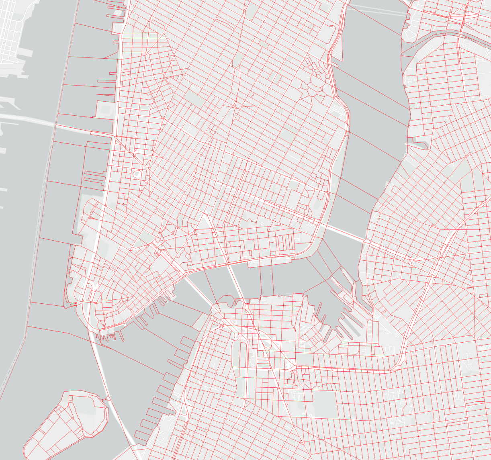
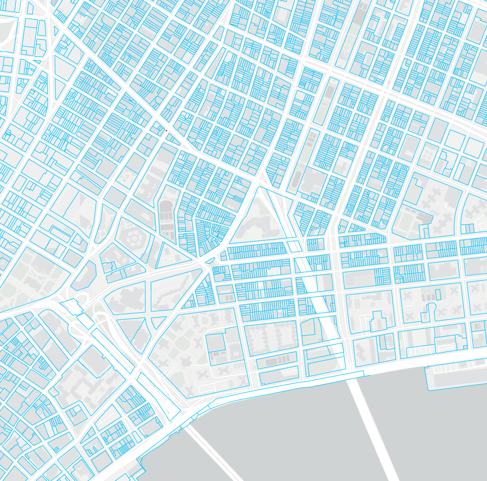

```{r setup, include=FALSE}
knitr::opts_chunk$set(echo = TRUE)
```
# Section #01: Benchmarking Data Exploration

### Data source for this section
- 2016 LL33 Data Disclosure for CY2015 reporting, Government of New York City. <https://www.nyc.gov/site/buildings/codes/benchmarking.page>

The purpose of this section is to understand the dataset that we are going to use as the input of building energy consumption intensity - 2015 building energy consumption benchmarking data collected under NYC Local Law 84/133 Energy Benchmarking, which requires owners and managers of buildings larger than 50,000 square (25,000 after 2016) to report their building’s energy usage to the City of New York on a yearly basis. 

The column representing the energy consumption intensity is Site_EUI, and there are many factors impacting this value, like Water, ELectricity, building age

```{r}
library(tidyverse)
library(ggplot2)

# Load raw data
file_path <- file.path(dirname(rstudioapi::getSourceEditorContext()$path), "dataset/NYCBuildingEnergyUse/nyc_benchmarking_disclosure_data_reported_in_2016.csv")
raw_data <- read_csv(file_path)
# Pre-processing
my_data <- raw_data %>%
  filter(DOF_Benchmarking_Submission_Status == "In Compliance") %>% # filter valid Benchmarking Submission Status
  select(Record_Number, 
         Site_EUI_kBtu_per_sqft,
         Weather_Normalized_Site_Electricity_Intensity_kWh_per_sqft,
         Weather_Normalized_Site_Natural_Gas_Intensity_therms_per_sqft,
         Total_GHG_Emissions_Metric_Tons_CO2e, 
         Municipally_Supplied_Potable_Water_Indoor_Intensity_gal_per_sqft
         ) %>%
  na.omit() %>% # quit properties with missing values
  rename(Record = Record_Number, # rename as the column names are too long
         EUI = Site_EUI_kBtu_per_sqft,
         EI = Weather_Normalized_Site_Electricity_Intensity_kWh_per_sqft,
         NGI = Weather_Normalized_Site_Natural_Gas_Intensity_therms_per_sqft,
         GHG = Total_GHG_Emissions_Metric_Tons_CO2e, 
         WI = Municipally_Supplied_Potable_Water_Indoor_Intensity_gal_per_sqft)

# Fit in linear model with different X variables
# Create a scatterplot with regression line
ggplot(data = my_data, aes(x = EI, y = EUI)) + 
  geom_smooth(method = "lm", se = FALSE, color = "lightblue") +
  geom_point(size = 0.7) + 
  labs(x = "Electricity Intensity(kWh/sqft)", y = "EUI(kBtu/sqft)", title = "Linear Regression of EUI vs EI") +
  theme(plot.title = element_text(hjust = 0.5)) # make title in the middle
ggplot(data = my_data, aes(x = NGI, y = EUI)) + 
  geom_smooth(method = "lm", se = FALSE, color = "lightblue") +
  geom_point(size = 0.7) + 
  labs(x = "Natural Gas Intensity(therms/sqft)", y = "EUI(kBtu/sqft)", title = "Linear Regression of EUI vs NGI") +
  theme(plot.title = element_text(hjust = 0.5))
ggplot(data = my_data, aes(x = GHG, y = EUI)) + 
  geom_smooth(method = "lm", se = FALSE, color = "lightblue") +
  geom_point(size = 0.7) + 
  labs(x = "Total GHG Emissions(tons)", y = "EUI(kBtu/sqft)", title = "Linear Regression of EUI vs GHG") +
  theme(plot.title = element_text(hjust = 0.5))
ggplot(data = my_data, aes(x = WI, y = EUI)) + 
  geom_smooth(method = "lm", se = FALSE, color = "lightblue") +
  geom_point(size = 0.7) + 
  labs(x = "Water Intensity(gal/sqft)", y = "EUI(kBtu/sqft)", title = "Linear Regression of EUI vs WI") +
  theme(plot.title = element_text(hjust = 0.5))

```

# Section #02: Spatial Join
The purpose of the spatial join operation is to join the data from American Community Survey(ACS) collected by Census Bureau to the 2015 building energy consumption benchmarking data collected under NYC Local Law 84/133 Energy Benchmarking.

### Data source for spatial join
- 2016 LL33 Data Disclosure for CY2015 reporting, Government of New York City. <https://www.nyc.gov/site/buildings/codes/benchmarking.page>
- 2010 Shapefiles of NYC census blocks, United States Census Bureau. <https://www.census.gov/geographies/mapping-files/time-series/geo/tiger-line-file.html>
- 2023 Shapefiles of NYC Tax Lot (BBL), NYC Open Data. <https://www.nyc.gov/site/planning/data-maps/open-data.page#pluto>

### Step #01: shapefile importing and visualization
Import the .shp files to and visualize the polygons in Arcgis Pro
<center>

{width=70%}

{width=70%}

{width=70%}

{width=70%}


</center>

### Step #02: spatial join using Tax Lot data and Census block data
Spatial join with options:
- Target features: Tax Lot data
- Join features: Census block data
- Join operation: One to one
- Match option: Within
- Fields to join: GeoId (the only required feature for joining ACS data)

This generate a new Tax Lot data table with a new column of the Census Block it belongs to. This means we have BBL number and Census Block geoID in each row.

### Step #03: join  building energy data
Join the geoID data to the building energy dataset using the field of BBL. This results in a new building energy use data table with a new column of Census Block geoID information it belongs to.


```{r}
# load benchmarking table
BR <- read.csv(file = paste0(file.path(dirname(rstudioapi::getSourceEditorContext()$path)),
                             "/dataset/NYC_Building_Energy_with_GEOID/table.csv"),
                 header=TRUE) %>%
  data.frame()

head(BR)

```
# Section #03: Next Step - Join ACS dataset to building energy dataset using the BR above

