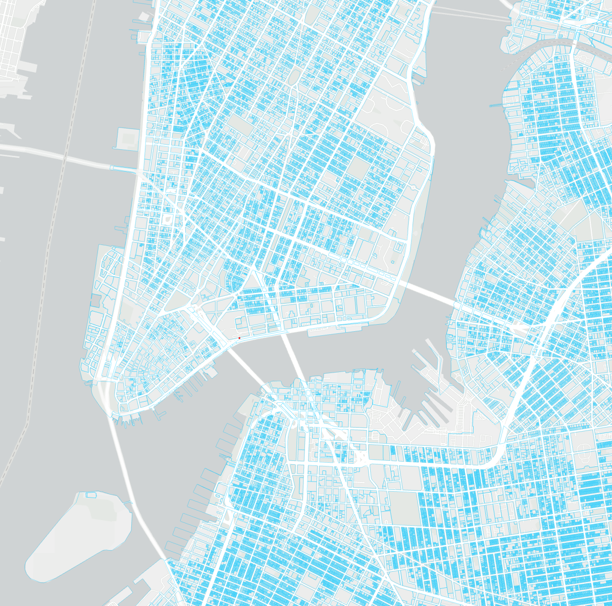
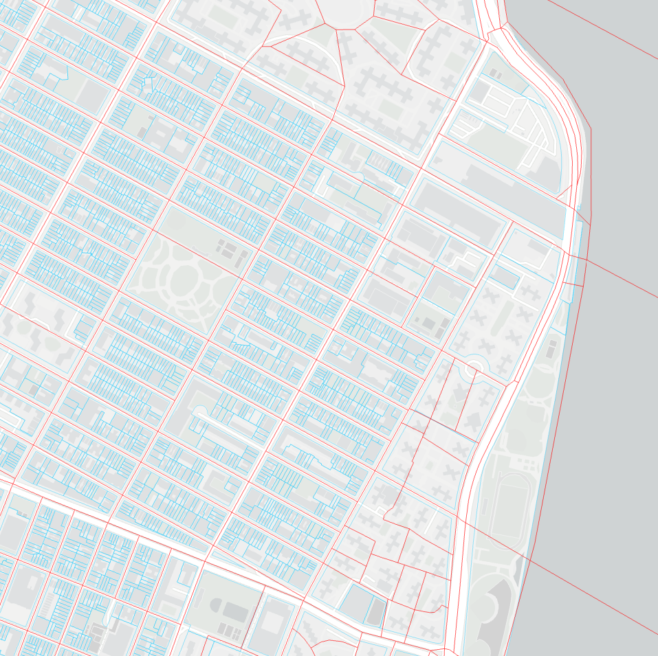

## 1. Research Questions

Nowadays, the issue of environmental protection and energy consumption is becoming increasingly important. A potential solution to create sustainable cities is through the implementation of Net-Zero cities. These cities provide numerous benefits, such as reduced greenhouse gas emissions, enhanced economic development, and improved quality of life. However, achieving this status is a complex task due to challenges like existing infrastructure, resistance to change, lack of funding, regulatory barriers, and technical challenges.

To aid cities with high energy usage, such as New York City, in realizing the Net-Zero vision, we aim to examine the key factors that influence building energy use intensity. Our research will involve developing a basic model by analyzing the relationships between building energy use intensity and resource consumption such as water, electricity, and gas. We will then expand the model by incorporating additional factors like income level, demographic data, and health conditions to build an improved model. By investigating the coefficients of the improved model, we can determine how these factors impact building energy use intensity and provide recommendations based on our findings. We believe that this research will be valuable for achieving sustainable urban development.

## 2. Data Source
- 2016 LL33 Data Disclosure for CY2015 reporting, Government of New York City. <https://www.nyc.gov/site/buildings/codes/benchmarking.page>
- 2010 Shapefiles of NYC census blocks, United States Census Bureau. <https://www.census.gov/geographies/mapping-files/time-series/geo/tiger-line-file.html>
- 2023 Shapefiles of NYC Tax Lot (BBL), NYC Open Data. <https://www.nyc.gov/site/planning/data-maps/open-data.page#pluto>


## 3. Research Procedure #01 Basice Model: Benchmarking Data Exploration

#### 3.1 Load and check benchmarking data
The purpose of this section is to understand the dataset that we are going to use as the input of building energy consumption intensity - 2015 building energy consumption benchmarking data collected under NYC Local Law 84/133 Energy Benchmarking, which requires owners and managers of buildings larger than 50,000 square (25,000 after 2016) to report their building’s energy usage to the City of New York on a yearly basis. 

The column representing the energy consumption intensity is Site_EUI, and there are many factors impacting this value, like Water, electricity, building age, etc...

```{r ,warning=FALSE,  message=FALSE, error=FALSE}
library(tidyverse)

# Load raw data
file_path <- file.path(dirname(rstudioapi::getSourceEditorContext()$path), "dataset/NYCBuildingEnergyUse/nyc_benchmarking_disclosure_data_reported_in_2016.csv")
raw_data <- read_csv(file_path)
```

```{r}
# Understanding the raw-dataset

# view the first few rows of the dataset

# get summary statistics for each column
# summary(raw_data) 

# get information about the structure of the dataset
# str(raw_data)  

```

#### 3.2 Process missing values (not completed in this sprint)
Checking and removing missing values
```{r}
# 0. Check for missing values in each column
# raw_data %>%
  # summarize_all(funs(sum(is.na(.))))
# 1. Removing missing values: 
# data_clean <- na.omit(data)

#2.use mean imputation to replace missing values with the mean of non-missing values:
#library(missForest)
#data_imputed <- missForest(data)$ximp

#3.Using prediction models:
#library(mice)
#data_imputed <- mice(data, method = "pmm", m = 5, maxit = 50)
#This code uses the mice() function to perform multiple imputation using predictive mean matching (method = "pmm") with 5 imputations (m = 5) and a maximum of 50 iterations (maxit = 50).
```


#### 3.3 Rename colums to make better legibility
Rename columns to increase legibility and convenience
```{r}
# Pre-processing
my_data <- raw_data %>%
  filter(DOF_Benchmarking_Submission_Status == "In Compliance") %>% # filter valid Benchmarking Submission Status
  select(Record_Number, 
         Primary_Property_Type,
         Site_EUI_kBtu_per_sqft,
         Weather_Normalized_Site_Electricity_Intensity_kWh_per_sqft,
         Weather_Normalized_Site_Natural_Gas_Intensity_therms_per_sqft,
         Total_GHG_Emissions_Metric_Tons_CO2e, # use net value 
         Direct_GHG_Emissions_Metric_Tons_CO2e, # new
         Indirect_GHG_Emissions_Metric_Tons_CO2e, # new
         Municipally_Supplied_Potable_Water_Indoor_Intensity_gal_per_sqft,
# new added
         Year_Built,
         Property_GFA_Self_reported_sqft
         ) %>%
  
  # change totoal value to net value
  
#my_data <- my_data %>%
  #mutate(Total_GHG_Emissions_Metric_Tons_CO2e_per_sqft = Total_GHG_Emissions_Metric_Tons_CO2e / Property_GFA_Self_reported_sqft)
  #mutate
  #mutate

na.omit() %>% # quit properties with missing values
  
  
  rename(Record = Record_Number, # rename as the column names are too long
         TYPE = Primary_Property_Type,
         EUI = Site_EUI_kBtu_per_sqft,
         EI = Weather_Normalized_Site_Electricity_Intensity_kWh_per_sqft,
         NGI = Weather_Normalized_Site_Natural_Gas_Intensity_therms_per_sqft,
         GHG = Total_GHG_Emissions_Metric_Tons_CO2e, 
         WI = Municipally_Supplied_Potable_Water_Indoor_Intensity_gal_per_sqft,
         YB = Year_Built # new
         # add sqrt-GHG
         )

nrow(my_data)
```


#### 3.4 Building linear models of EUI and basic factors like electricity usage, water usage, etc.
The R-squared value ranges from 0 to 1, with higher values indicating a better fit between the model and the data.

```{r}
# Fit in linear model with different X variables

# electricity
model_EI <- lm(EUI ~ EI, data = my_data)
summary(model_EI)$r.squared

# natural gas
model_NGI <- lm(EUI ~ NGI, data = my_data)
summary(model_NGI)$r.squared

# change ghg to net value
# green house gas
model_GHG <- lm(EUI ~ GHG, data = my_data)
summary(model_GHG)$r.squared

# water
model_WI <- lm(EUI ~ WI, data = my_data)
summary(model_WI)$r.squared

# building age
model_YB <- lm(EUI ~ YB, data = my_data)
summary(model_YB)$r.squared
```

#### 3.5 Building linear models of Log(EUI) and basic factors to reduce impact of outliers
Modeling with basic single factors

```{r}
# Fit in linear model with different X variables use log-y

model_EI <- lm(log(EUI) ~ EI, data = my_data)
summary(model_EI)$r.squared

model_NGI <- lm(log(EUI) ~ NGI, data = my_data)
summary(model_NGI)$r.squared

# change ghg to net value
model_GHG <- lm(log(EUI) ~ GHG, data = my_data)
summary(model_GHG)$r.squared

model_WI <- lm(log(EUI)~ WI, data = my_data)
summary(model_WI)$r.squared

model_YB <- lm(log(EUI)~ YB, data = my_data)
summary(model_YB)$r.squared
```

#### 3.6 Build OLS models
Modeling with multiple variables to check interaction.

```{r}
# use OLS with y

model_ols_y <- lm(EUI ~ EI * NGI * GHG , data = my_data)
summary(model_ols_y)

# use Ols with log-y

model_ols_logy <- lm(log(EUI) ~ EI * NGI * GHG, data = my_data) # ghg net value
summary(model_ols_logy)


```


#### 3.7 Some visualizations
Plots for basic factors modeling

```{r, warning=FALSE,  error=FALSE, message=FALSE}
library(gridExtra)
new_data <- my_data %>%
  filter((TYPE == "Office" |
         TYPE == "Hotel" |
         TYPE == "Senior Care Community" |
         TYPE == "Non-Refrigerated Warehouse" |
         TYPE == "Residence Hall/Dormitory") & EI < 15000 # filter out obvious outlier
         )

# EUI vs EI
# y ~ x  
lm1.ei <- lm(EUI ~ EI * TYPE, data = new_data)
summary(lm1.ei)
newdata1.ei <- new_data %>%
  data_grid(TYPE, EI, EUI) %>%
  add_predictions(lm1.ei) %>%
  add_residuals(lm1.ei)
ggplot(data = new_data) +
  geom_point(aes(x = EI, y = EUI, color = TYPE), size = 0.7) +
  geom_line(data = newdata1.ei, aes(x = EI, y = pred, color = TYPE)) +
  labs(x = "Electricity Intensity(kWh/sqft)", y = "EUI(kBtu/sqft)", title = "Linear Regression of EUI vs EI") +
  theme(plot.title = element_text(hjust = 0.5)) # make title in the middle
# log(y) ~ x
lm2.ei <- lm(log(EUI) ~ EI * TYPE, data = new_data)
summary(lm2.ei)
newdata2.ei <- new_data %>%
  data_grid(TYPE, EI, EUI) %>%
  add_predictions(lm2.ei) %>%
  add_residuals(lm2.ei)
ggplot(data = new_data) +
  geom_point(aes(x = EI, y = log(EUI), color = TYPE), size = 0.7) +
  geom_line(data = newdata2.ei, aes(x = EI, y = pred, color = TYPE)) +
  labs(x = "Electricity Intensity(kWh/sqft)", y = "log(EUI)(kBtu/sqft)", title = "Linear Regression of log(EUI) vs EI") +
  theme(plot.title = element_text(hjust = 0.5))

# EUI vs NGI
# y ~ x  
lm1.ngi <- lm(EUI ~ NGI * TYPE, data = new_data)
summary(lm1.ngi)
newdata1.ngi <- new_data %>%
  data_grid(TYPE, NGI, EUI) %>%
  add_predictions(lm1.ngi) %>%
  add_residuals(lm1.ngi)
ggplot(data = new_data) +
  geom_point(aes(x = NGI, y = EUI, color = TYPE), size = 0.7) +
  geom_line(data = newdata1.ngi, aes(x = NGI, y = pred, color = TYPE)) +
  labs(x = "Electricity Intensity(kWh/sqft)", y = "EUI(kBtu/sqft)", title = "Linear Regression of EUI vs NGI") +
  theme(plot.title = element_text(hjust = 0.5)) # make title in the middle
# log(y) ~ x
lm2.ngi <- lm(log(EUI) ~ NGI * TYPE, data = new_data)
summary(lm2.ngi)
newdata2.ngi <- new_data %>%
  data_grid(TYPE, NGI, EUI) %>%
  add_predictions(lm2.ngi) %>%
  add_residuals(lm2.ngi)
ggplot(data = new_data) +
  geom_point(aes(x = NGI, y = log(EUI), color = TYPE), size = 0.7) +
  geom_line(data = newdata2.ngi, aes(x = NGI, y = pred, color = TYPE)) +
  labs(x = "Electricity Intensity(kWh/sqft)", y = "log(EUI)(kBtu/sqft)", title = "Linear Regression of log(EUI) vs NGI") +
  theme(plot.title = element_text(hjust = 0.5))


# library(gridExtra)
# # Create a scatterplot with regression line
# p1.ei <- ggplot(data = my_data, aes(x = EI, y = EUI)) + 
#   geom_smooth(method = "lm", se = FALSE, color = "lightblue") +
#   geom_point(size = 0.7) + 
#   labs(x = "Electricity Intensity(kWh/sqft)", y = "EUI(kBtu/sqft)", title = "Linear Regression of EUI vs EI") +
#   theme(plot.title = element_text(hjust = 0.5)) # make title in the middle
# p2.ei <- ggplot(data = my_data, aes(x = EI, y = log(EUI))) + 
#   geom_smooth(method = "lm", se = FALSE, color = "lightblue") +
#   geom_point(size = 0.7) + 
#   labs(x = "Electricity Intensity(kWh/sqft)", y = "log(EUI)(kBtu/sqft)", title = "Linear Regression of log(EUI) vs EI") +
#   theme(plot.title = element_text(hjust = 0.5))
# grid.arrange(p1.ei, p2.ei, ncol = 2)
# 
# p1.ngi <- ggplot(data = my_data, aes(x = NGI, y = EUI)) + 
#   geom_smooth(method = "lm", se = FALSE, color = "lightblue") +
#   geom_point(size = 0.7) + 
#   labs(x = "Natural Gas Intensity(therms/sqft)", y = "EUI(kBtu/sqft)", title = "Linear Regression of EUI vs NGI") +
#   theme(plot.title = element_text(hjust = 0.5))
# p2.ngi <- ggplot(data = my_data, aes(x = NGI, y = log(EUI))) + 
#   geom_smooth(method = "lm", se = FALSE, color = "lightblue") +
#   geom_point(size = 0.7) + 
#   labs(x = "Natural Gas Intensity(therms/sqft)", y = "log(EUI)(kBtu/sqft)", title = "Linear Regression of log(EUI) vs NGI") +
#   theme(plot.title = element_text(hjust = 0.5))
# grid.arrange(p1.ngi, p2.ngi, ncol = 2)
# 
# p1.ghg <- ggplot(data = my_data, aes(x = GHG, y = EUI)) + 
#   geom_smooth(method = "lm", se = FALSE, color = "lightblue") +
#   geom_point(size = 0.7) + 
#   labs(x = "Total GHG Emissions(tons)", y = "EUI(kBtu/sqft)", title = "Linear Regression of EUI vs GHG") +
#   theme(plot.title = element_text(hjust = 0.5))
# p2.ghg <- ggplot(data = my_data, aes(x = GHG, y = log(EUI))) + 
#   geom_smooth(method = "lm", se = FALSE, color = "lightblue") +
#   geom_point(size = 0.7) + 
#   labs(x = "Total GHG Emissions(tons)", y = "log(EUI)(kBtu/sqft)", title = "Linear Regression of log(EUI) vs GHG") +
#   theme(plot.title = element_text(hjust = 0.5))
# grid.arrange(p1.ghg, p2.ghg, ncol = 2)
# 
# p1.wi <- ggplot(data = my_data, aes(x = WI, y = EUI)) + 
#   geom_smooth(method = "lm", se = FALSE, color = "lightblue") +
#   geom_point(size = 0.7) + 
#   labs(x = "Water Intensity(gal/sqft)", y = "EUI(kBtu/sqft)", title = "Linear Regression of EUI vs WI") +
#   theme(plot.title = element_text(hjust = 0.5))
# p2.wi <- ggplot(data = my_data, aes(x = WI, y = log(EUI))) + 
#   geom_smooth(method = "lm", se = FALSE, color = "lightblue") +
#   geom_point(size = 0.7) + 
#   labs(x = "Water Intensity(gal/sqft)", y = "log(EUI)(kBtu/sqft)", title = "Linear Regression of log(EUI) vs WI") +
#   theme(plot.title = element_text(hjust = 0.5))
# grid.arrange(p1.wi, p2.wi, ncol = 2)
```

## 4. Research Procedure #02 Improved Model: Joining Census data (Spatial join completed, waiting for joining census data)

#### 4.1: Spatial Join
The purpose of the spatial join operation is to join the data from American Community Survey(ACS) collected by Census Bureau to the 2015 building energy consumption benchmarking data collected under NYC Local Law 84/133 Energy Benchmarking.

**4.1.1 shapefile importing and visualization**
<br>
Import the .shp files to and visualize the polygons in Arcgis Pro
<center>

{width=70%}

{width=70%}

{width=70%}

{width=70%}


</center>

**4.1.2 spatial join using Tax Lot data and Census block data**
<br>
Spatial join with options:
- Target features: Tax Lot data
- Join features: Census block data
- Join operation: One to one
- Match option: Within
- Fields to join: GeoId (the only required feature for joining ACS data)

This generate a new Tax Lot data table with a new column of the Census Block it belongs to. This means we have BBL number and Census Block geoID in each row.

**4.1.3 join  building energy data**
<br>
Join the geoID data to the building energy dataset using the field of BBL. This results in a new building energy use data table with a new column of Census Block geoID information it belongs to.


```{r}
# load benchmarking table
BR <- read.csv(file = paste0(file.path(dirname(rstudioapi::getSourceEditorContext()$path)),
                             "/dataset/NYC_Building_Energy_with_GEOID/table.csv"),
                 header=TRUE) %>%
  data.frame()

head(BR)

```
#### 4.2 Join ACS dataset to building energy dataset using the BR above (Next Step)

## 5. Research Procedure #03 Intepret Coefficients: Exploring  the coefficients of the improved model (Next Step)

## 6. Research Procedure #04 Validate Model: Use the model to predict building energy use intensity of benchmarking data collected in 2017 and check the accuracy (Next Step)

## 7. Conclusion and Suggestions (Next Step)

