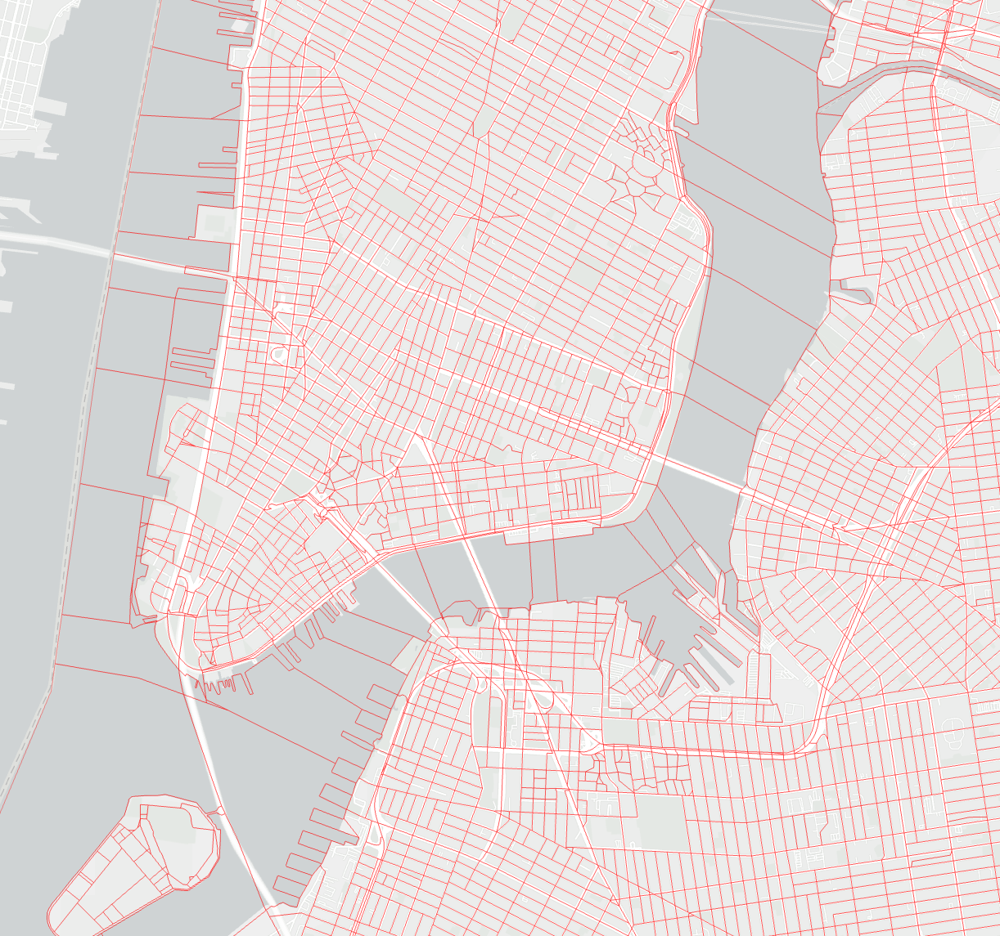
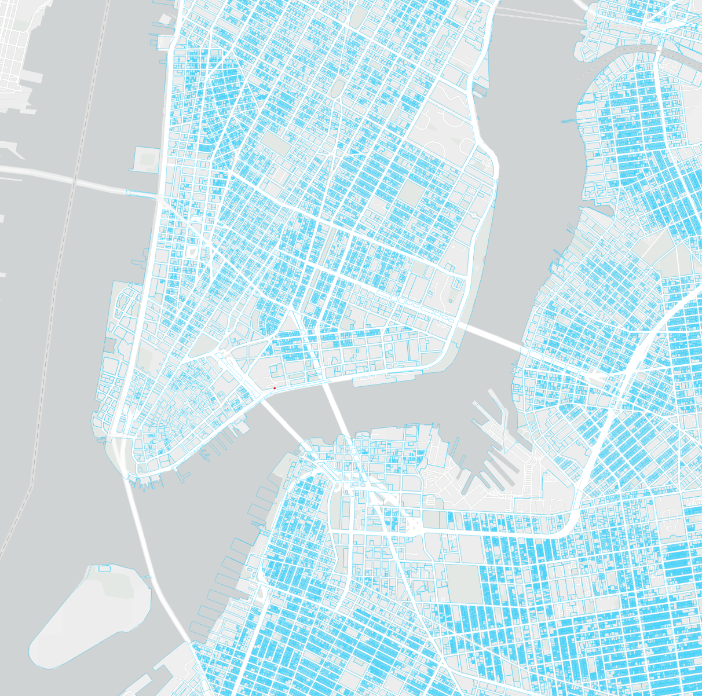
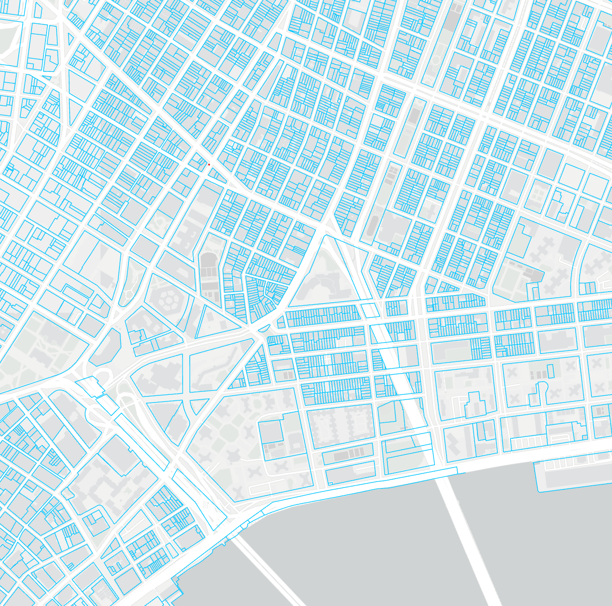
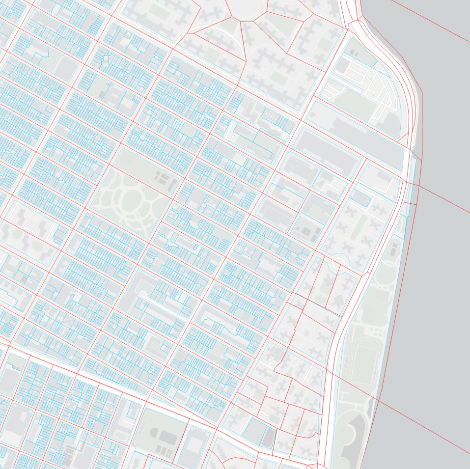

```{r setup, include=FALSE}
knitr::opts_chunk$set(echo = TRUE)
```
The purpose of the spatial join operation is to join the data from American Community Survey(ACS) collected by Census Bureau to the 2015 building energy consumption benchmarking data collected under NYC Local Law 84/133 Energy Benchmarking, which requires owners and managers of buildings larger than 50,000 square (25,000 after 2016) to report their building’s energy usage to the City of New York on a yearly basis. 

### Data source for spatial join
- 2016 LL33 Data Disclosure for CY2015 reporting, Government of New York City. <https://www.nyc.gov/site/buildings/codes/benchmarking.page>
- 2010 Shapefiles of NYC census blocks, United States Census Bureau. <https://www.census.gov/geographies/mapping-files/time-series/geo/tiger-line-file.html>
- 2023 Shapefiles of NYC Tax Lot (BBL), NYC Open Data. <https://www.nyc.gov/site/planning/data-maps/open-data.page#pluto>

### Step #01: shapefile importing and visualization
Import the .shp files to and visualize the polygons in Arcgis Pro
<center>

{width=70%}

{width=70%}

{width=70%}

{width=70%}


</center>

### Step #02: spatial join using Tax Lot data and Census block data
Spatial join with options:
- Target features: Tax Lot data
- Join features: Census block data
- Join operation: One to one
- Match option: Within
- Fields to join: GeoId (the only required feature for joining ACS data)

This generate a new Tax Lot data table with a new column of the Census Block it belongs to. This means we have BBL number and Census Block geoID in each row.

### Step #03: join  building energy data
Join the geoID data to the building energy dataset using the field of BBL. This results in a new building energy use data table with a new column of Census Block geoID information it belongs to.

```{r}
# set correct working directory
setwd("D:/OneDrive/education/S23_CMU/19-603_Data_Science_for_Technology_Innovation_and_Policy/19433-2000wattCommunity")
library("tidyverse")
```

```{r}
# load benchmarking table
BR <- read.csv(file = paste0(getwd(),
                             "/dataset/NYC_Building_Energy_with_GEOID/table.csv"),
                 header=TRUE) %>%
  data.frame()

head(BR)

```
